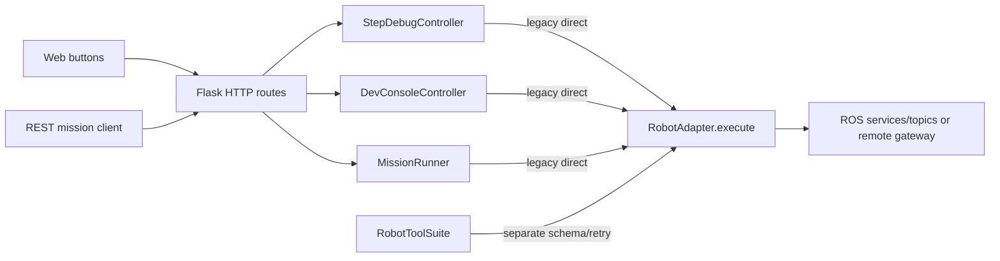
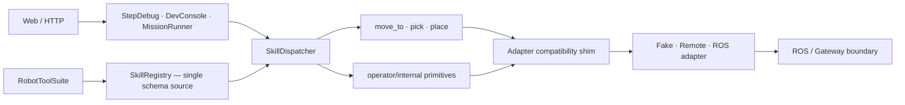
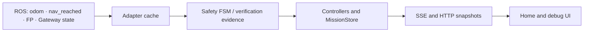

# Phase 0 architecture and call-chain baseline

Baseline date: 2026-07-31. Target runtime: Ubuntu 22.04, ROS2 Humble,
Python 3.10. This document records both the behavior found at the start of
Phase 0 and the Phase 1 routing now implemented.

## Command chain

Before Phase 1, StepDebug, MissionRunner, and DevConsole each called
`adapter.execute()` independently, while RobotToolSuite owned a separate tool
schema and retry path.

Phase 1 creates one registry and dispatcher in the API server. All three
production mutation sources share its per-robot lock, strict schema,
idempotency table, result normalization, and cancellation state.

`PHI_ACTION_EXECUTOR` selects exactly one execution path. Fake and ROS-shaped
stubs default to `skills`; `RosAcceptanceAdapter` defaults to
`legacy-direct` until the separately approved HIL gate. There is no shadow
execution.

## State chain

The application odometry authority is `/odom`. The hardware-side `/Odometry`
name is translated only at the ZMQ boundary. `nav_reached=true` is the
navigation completion signal; a successful `/start_navigation` response alone
is not arrival.

## Five observed UI/API paths

| Path | Entry | Phase 0 observed behavior | Phase 1 routing |
|---|---|---|---|
| Home RUN | `POST /api/dev/step_debug/load` | Generates and loads a plan only; no adapter action | Unchanged; no dispatcher call |
| Debug single step | `POST /api/dev/step_debug/execute` | One background action; legacy ROS pick required prior target lock | One dispatcher invocation; fake/stub composite pick owns target lifecycle |
| Debug auto | `POST /api/dev/step_debug/auto_run` | Sequential loop, FP target selection on ROS, fail-stop | Sequential dispatcher calls, fail-stop, no implicit action retry |
| DevConsole auto | `POST /api/dev/auto/start` | MissionRunner path without StepDebug-owned FP preselection | Shared dispatcher; composite pick owns FP precondition in skills mode |
| REST Mission | `POST /api/missions/:id/run` | MissionRunner path; adapter reset then execution | Reset and every mutating step use shared dispatcher |

## Baseline defects that are not compatibility requirements

- Home STOP can address a missing REST mission ID although Home RUN only loads
  StepDebug state.
- Legacy worker detachment discarded results while the physical call continued.
- Abort/reset represented a local epoch change, not confirmed robot stop.
- SSE payloads and local controller state could diverge after detached calls.
- Concurrent StepDebug, MissionRunner, and manual calls could overlap.
- Legacy phase runners used stale schemas and could report success with zero
  passing scenarios.

The dispatcher prevents a detached or timed-out physical call from releasing
the per-robot writer lock. Controller/UI cleanup may ignore an old result, but
cannot start a successor until the backend actually drains.

