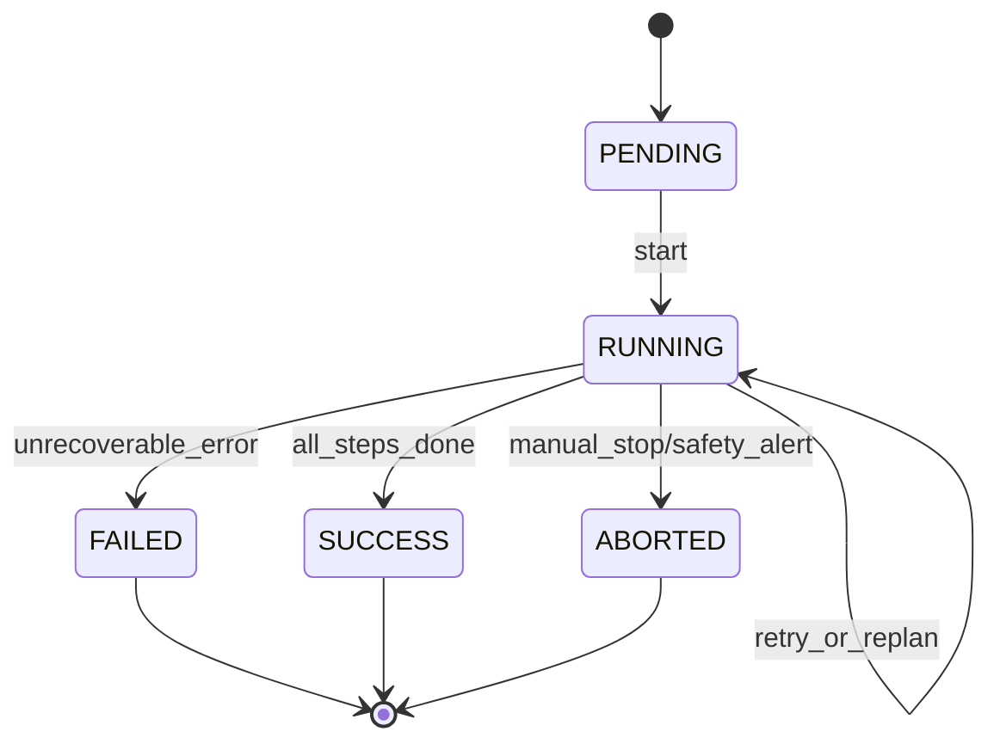

# Phase 0：契约冻结（1-2 天）

目标：冻结 Agentic 与执行后端（Fake/Real）的接口契约，确保后续开发并行不返工。

## 1. 本阶段交付物

1. 工具请求/响应协议（Tool Contract v1）
2. 错误码字典（Error Code Dictionary v1）
3. 任务状态机（Task State Machine v1）
4. 评审与变更流程（Review + Change Control）
5. 验收清单（Sign-off Checklist）

---

## 2. Tool Contract v1

## 2.1 设计原则
- Agent 仅调用工具，不直接控制机器人底层。
- Fake 与 Real 必须返回同构字段。
- 所有结果必须结构化，不允许自由文本错误。
- 所有调用必须可追踪：`request_id`, `goal_id`, `step_id` 必填。

## 2.2 请求协议

```json
{
	"request_id": "req-uuid",
	"goal_id": "goal-uuid",
	"step_id": "step-003",
	"tool": "move_to",
	"args": {
		"x": 1.2,
		"y": 0.3,
		"z": 0.0,
		"speed": 0.2,
		"timeout_s": 20
	},
	"meta": {
		"priority": "normal",
		"issued_at": 1710000000,
		"trace_id": "trace-uuid"
	}
}
```

字段约束：
- `request_id`: string, 必填, 全局唯一。
- `goal_id`: string, 必填, 同一任务内一致。
- `step_id`: string, 必填, 单任务内唯一。
- `tool`: enum(`move_to`,`pick`,`place`,`get_pose`,`get_gripper_state`)。
- `args`: object, 必填；字段随 tool 变化。

## 2.3 响应协议

```json
{
	"request_id": "req-uuid",
	"status": "ok",
	"error_code": null,
	"message": "arrived",
	"state": {
		"pose": {"x": 1.2, "y": 0.3, "z": 0.0, "theta": 0.0},
		"holding": null
	},
	"metrics": {
		"latency_ms": 142,
		"sim_time_ms": 500
	}
}
```

失败响应：

```json
{
	"request_id": "req-uuid",
	"status": "error",
	"error_code": "NOT_REACHABLE",
	"message": "target blocked by obstacle",
	"state": {
		"pose": {"x": 0.5, "y": 0.1, "z": 0.0, "theta": 0.0},
		"holding": null
	},
	"metrics": {
		"latency_ms": 121
	}
}
```

字段约束：
- `status`: enum(`ok`,`error`)。
- `error_code`: `status=ok` 时必须为 `null`；`status=error` 时必须为已定义错误码。
- `state`: 必填，用于后续 replanning。

## 2.4 工具参数约束（最小版本）

- `move_to(args)`
	- 必填：`x`,`y`,`z`,`timeout_s`
	- 可选：`speed`
	- 范围：`timeout_s > 0`

- `pick(args)`
	- 必填：`object_id`,`timeout_s`
	- 可选：`grip_force`

- `place(args)`
	- 必填：`x`,`y`,`z`,`timeout_s`
	- 可选：`object_id`

- `get_pose(args)`
	- `args` 可为空对象

- `get_gripper_state(args)`
	- `args` 可为空对象

---

## 3. 错误码字典 v1

## 3.1 标准错误码

| 错误码 | 含义 | 是否可重试 | Replan 建议 |
|---|---|---|---|
| `NOT_REACHABLE` | 目标不可达 | 否 | 是，改路径/改目标 |
| `OBSTRUCTED` | 路径/目标被阻挡 | 视场景 | 是，先 reposition |
| `GRIP_FAIL` | 抓取失败 | 是（限次） | 是，调整姿态后再抓 |
| `TIMEOUT` | 执行超时 | 是（限次） | 是，降速或拆步 |
| `INVALID_ARGS` | 参数非法 | 否 | 否，直接修正输入 |
| `PRECONDITION_FAILED` | 前置条件不满足 | 否 | 是，补前置步骤 |
| `INTERNAL_ERROR` | 后端内部错误 | 是（限次） | 失败升级/人工接管 |

## 3.2 错误处理策略（Agent 侧）
- `retryable`: `GRIP_FAIL`, `TIMEOUT`, 部分 `INTERNAL_ERROR`
- `non-retryable`: `INVALID_ARGS`, 明确不可达的 `NOT_REACHABLE`
- 全局限制：
	- 单步骤最大重试次数：`max_step_retries = 2`
	- 单任务最大重规划次数：`max_replans = 2`

---

## 4. 任务状态机 v1

状态集合：`PENDING`, `RUNNING`, `SUCCESS`, `FAILED`, `ABORTED`



状态迁移规则：
- `PENDING -> RUNNING`: 接收并确认首个可执行计划。
- `RUNNING -> RUNNING`: 工具失败但仍在重试/重规划窗口内。
- `RUNNING -> FAILED`: 超出重试/重规划阈值或遇到不可恢复错误。
- `RUNNING -> ABORTED`: 人工中断或 monitor 安全告警。
- `RUNNING -> SUCCESS`: 全步骤完成且结果验收通过。

---

## 5. 评审与变更流程

## 5.1 评审参与者
- Agentic 负责人（你们）
- 执行后端负责人（机器人控制团队）
- 测试负责人（回归与指标）

## 5.2 评审输出
- 结论：`Accepted` / `Accepted with Changes` / `Rejected`
- 冻结版本：`Contract v1.0`
- 待办项：明确 owner + deadline

## 5.3 变更控制
- Phase 1-2 默认禁止破坏性改动。
- 若需改字段：
	- 新增字段允许（向后兼容）
	- 删除/改名必须走版本升级（v1 -> v2）

---

## 6. 验收清单（Sign-off）

- [ ] 工具请求/响应 JSON 示例通过双方评审
- [ ] 错误码与可重试策略确认
- [ ] 状态机迁移规则确认
- [ ] Fake/Real 返回字段兼容性清单确认
- [ ] 追踪字段（request_id/goal_id/step_id/trace_id）确认
- [ ] 变更流程与版本策略确认

当以上 6 项全部勾选，Phase 0 完成。

---

## 7. 参考文件位置（仓库）

- 执行循环与注入：`nanobot/agent/runner.py`
- Agent 主循环：`nanobot/agent/loop.py`
- Hook 抽象：`nanobot/agent/hook.py`
- 工具注册：`nanobot/agent/tools/registry.py`
- 记忆系统：`nanobot/agent/memory.py`
- 周期检查（heartbeat）：`nanobot/heartbeat/service.py`
- 总体实施计划：`phi_robot/plan.md`
- 架构说明：`phi_robot/robot-agent-architecture.md`

