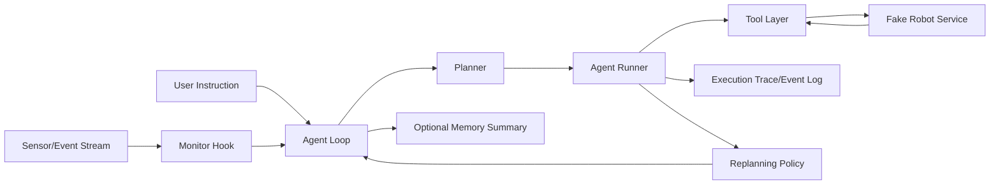

# 机器人 Agentic 实施方案（可落地版本）

## 1. 目标与范围

### 1.1 目标
- 在不接入真实机器人运动控制的前提下，完成并验证 agentic 核心能力：
	- 任务规划（Planning）
	- 工具编排（Tool Orchestration）
	- 监控注入（Monitor + Hook）
	- 重规划（Replanning）
	- 可选记忆（Memory Summary）

### 1.2 范围边界
- 我方负责：Agent 逻辑、Tool 抽象、监控与重规划、测试体系。
- 他方负责：真实机器人控制（运动、抓取、避障、低层驱动）。
- 临时替代：`Fake Robot Service`（仿真服务）作为底层执行端。

### 1.3 成功定义
- 在仿真环境中，给定任务可稳定跑通完整闭环。
- 失败场景下可触发预期的重试/重规划/终止。
- 所有关键路径具备自动化回归测试。

---

## 2. 总体架构（实施视角）



核心原则：
- Agent 只做决策和流程控制，不直接接触低层运动。
- Tool 层是唯一执行边界，后续可从 Fake 无缝切换到 Real。
- 监控与重规划不依赖硬件实现，可先完整验证。

---

## 3. 模块拆分与职责

## 3.1 Planner 模块
- 输入：用户指令 + 当前世界摘要 + 历史执行结果。
- 输出：结构化计划（步骤列表）。
- 要求：
	- 每一步必须是 Tool 可执行动作。
	- 计划含 `goal_id`, `step_id`, `timeout_s`, `constraints`。

## 3.2 Tool Layer 模块
- 提供稳定接口：
	- `move_to`
	- `pick`
	- `place`
	- `get_pose`
	- `get_gripper_state`
- 职责：参数校验、超时控制、错误规范化、结果结构化。

## 3.3 Fake Robot Service 模块（替代真实运动）
- 职责：维护仿真世界状态并返回执行结果。
- 能力：
	- 状态机更新（位姿、抓取、目标物状态）
	- 故障注入（不可达、抓取失败、超时）
	- 场景回放（固定随机种子）

## 3.4 Monitor Hook 模块
- 挂接点：
	- `before_iteration`
	- `before_execute_tools`
	- `after_iteration`
- 职责：
	- 消费外部事件（新指令、告警）
	- 将事件转为注入消息（injection）
	- 安全阈值判定（如失败次数超限）

## 3.5 Replanning 模块
- 触发条件：
	- 工具执行失败且可恢复
	- 监控注入新指令
	- 周期性检查（heartbeat tick）
- 输出：
	- 更新计划（替代步骤）或中止决策。

## 3.6 Memory Summary（可选）
- 只保存摘要，不存原始大数据。
- 内容建议：
	- 上次失败原因
	- 当前任务阶段
	- 用户偏好（速度优先/安全优先）

---

## 4. 接口契约（统一协议）

## 4.1 Tool Request

```json
{
	"request_id": "req-uuid",
	"goal_id": "goal-uuid",
	"step_id": "step-003",
	"tool": "move_to",
	"args": {"x": 1.2, "y": 0.3, "z": 0.0, "speed": 0.2, "timeout_s": 20}
}
```

## 4.2 Tool Response

```json
{
	"request_id": "req-uuid",
	"status": "ok",
	"error_code": null,
	"message": "arrived",
	"state": {
		"pose": {"x": 1.2, "y": 0.3, "z": 0.0, "theta": 0.0},
		"holding": null
	},
	"metrics": {"latency_ms": 142, "sim_time_ms": 500}
}
```

失败示例：

```json
{
	"request_id": "req-uuid",
	"status": "error",
	"error_code": "NOT_REACHABLE",
	"message": "target blocked by obstacle",
	"state": {"pose": {"x": 0.5, "y": 0.1, "z": 0.0, "theta": 0.0}, "holding": null},
	"metrics": {"latency_ms": 121}
}
```

## 4.3 Error Code 规范
- `NOT_REACHABLE`
- `OBSTRUCTED`
- `GRIP_FAIL`
- `TIMEOUT`
- `INVALID_ARGS`
- `PRECONDITION_FAILED`
- `INTERNAL_ERROR`

## 4.4 Monitor Injection 事件

```json
{
	"event_id": "evt-uuid",
	"type": "new_instruction|safety_alert|priority_change",
	"priority": "high",
	"content": "立即暂停并改为放置到B2",
	"ts": 1710000000
}
```

---

## 5. 开发阶段与交付清单

## Phase 0：契约冻结（1-2 天）
交付：
- `tool` 请求/响应协议文档（本文件第 4 节）
- 错误码字典
- 任务状态机定义（`PENDING/RUNNING/SUCCESS/FAILED/ABORTED`）

验收：
- 评审通过，团队统一接口。

## Phase 1：Fake Robot Service（2-3 天）
交付：
- 可运行仿真服务（HTTP/gRPC 二选一）
- 场景配置文件（障碍物、箱子初始位置）
- 故障注入器（规则 + 随机种子）

验收：
- 5 个基础 API 全部可调用。
- 支持固定种子复现。

## Phase 2：Tool Layer 接入（2 天）
交付：
- Tool 封装（参数校验、超时、重试）
- 统一结构化日志（request_id/goal_id/step_id）

验收：
- Agent 能调用 fake 执行动作并拿到结构化结果。

## Phase 3：Monitor + Replanning（3-4 天）
交付：
- Hook 监听器（事件注入）
- 重规划策略（失败分类 + 限次重试）
- Heartbeat 周期评估

验收：
- 注入新指令后，当前计划可中断并切换新计划。
- 失败场景按策略触发重规划或终止。

## Phase 4：回归测试与指标（2-3 天）
交付：
- 用例集（至少 12 条）
- 指标看板（成功率、恢复率、延迟）
- 每日回归脚本

验收：
- 核心指标达标（见第 7 节）。

---

## 6. 测试方案（重点）

## 6.1 测试分层
- 单元测试：Tool 参数校验、错误码映射、replan 条件函数。
- 集成测试：Agent + Fake Service 全链路。
- 场景回放：固定初始状态和故障注入，验证输出轨迹。

## 6.2 最小必测场景（建议 12 条）
1. Happy Path：move/pick/place 一次成功。
2. move 不可达 -> replanning 成功。
3. pick 首次失败 -> retry 成功。
4. pick 持续失败 -> 终止并上报。
5. place 前收到高优先级新指令 -> 中断切换计划。
6. 工具超时 -> fallback 重试后成功。
7. 工具超时连续超限 -> fail-safe 终止。
8. 参数非法 -> 不下发执行，直接返回 `INVALID_ARGS`。
9. monitor 注入 safety_alert -> 立即 stop。
10. heartbeat 发现计划卡住 -> 触发重规划。
11. memory 存在失败摘要 -> 下次规划规避同类错误。
12. 随机故障 + 固定种子 -> 回放结果一致。

## 6.3 验收断言模板
- `assert task_status == SUCCESS`
- `assert replanning_count <= 2`
- `assert safety_violation_count == 0`
- `assert tool_call_sequence == expected_or_allowed_set`
- `assert mean_decision_latency_ms < threshold`

---

## 7. 指标与阈值（首版）
- Task Success Rate >= 90%（在标准回放集）
- Replan Recovery Rate >= 70%（可恢复故障集）
- Safety Violation Count = 0
- Mean Decision Latency < 1500ms（不含工具执行物理时间）
- Deterministic Replay Pass Rate = 100%（固定种子）

---

## 8. 风险与缓解
- 风险：Fake 与 Real 行为不一致。
	- 缓解：提前冻结接口契约；加入 Real Mock 回归样本。

- 风险：模型输出不稳定导致计划抖动。
	- 缓解：计划结构化约束 + step schema 校验 + 温度控制。

- 风险：重规划陷入循环。
	- 缓解：设置 `max_replan_attempts`，超限进入人工接管。

- 风险：注入事件与当前状态冲突。
	- 缓解：引入优先级与幂等事件处理（event_id 去重）。

---

## 9. 组织协作建议（与真实控制团队并行）
- 每周固定一次契约评审：只讨论接口与错误码，不讨论内部实现。
- 建立“兼容性清单”：Fake 返回字段必须与 Real 对齐。
- 提供 `adapter` 层：
	- `Tool -> Adapter -> Fake/Real`
	- 切换只改配置项 `ROBOT_BACKEND=fake|real`。

---

## 10. 最小落地清单（可执行）
1. 完成工具协议与错误码文档。
2. 实现 Fake Robot Service（带故障注入）。
3. 将 Tool 层接入 Fake 服务并打通链路。
4. 实现 Monitor Hook 与 Replanning 策略。
5. 建立 12 条场景回放测试。
6. 接入指标统计并设置验收阈值。

达到以上 6 项，即可证明 agentic 能力可用，后续只需替换执行后端。

---

## 11. 立即行动项（本周）
- Day 1：冻结接口 + 错误码 + 状态机。
- Day 2-3：实现 Fake Service + 场景配置。
- Day 4：接入 Tool 层 + 首条 Happy Path 打通。
- Day 5：加入 3 条失败场景 + 重规划逻辑。

本周产出验收标准：
- 可以稳定演示“用户指令 -> 规划 -> 工具执行 -> 失败重规划 -> 完成/终止”闭环。

